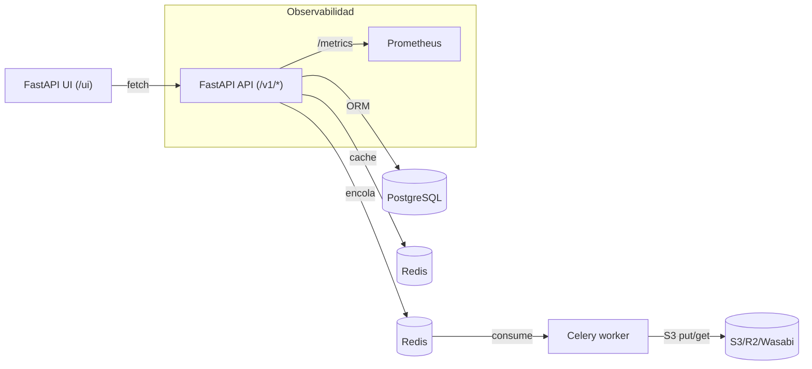

# Arquitectura

## Componentes
- `apps/api`: FastAPI + routers (templates, forms, preview, generate, jobs, history, apikeys, external, ocr).
- `apps/worker`: Celery + render (docxtpl + LibreOffice) + post-procesos (relleno `====`).
- `apps/ui`: plantillas HTML (designer, history, login).
- `infra/docker`: Dockerfiles (no root) y compose.
- `docs/`: guía completa.
- `assets/`: muestras (poder_amplio.doc).

## Flujos clave
1. **Autoform**: subes `.doc`/`.docx` → detecta `{{variables}}` → genera `FormDefinition`.
2. **Previsualización**: valida datos con Pydantic dinámico → cache Redis → devuelve DOCX.
3. **Generación**: crea `Job` → Celery renderiza (DOCX) y convierte a PDF/ODT/HTML → sube a S3 → API presigna URLs.
4. **Historial**: consulta jobs y muestra descargas.
5. **API externa**: `X-API-Key` (por proyecto) genera documentos sin JWT.
